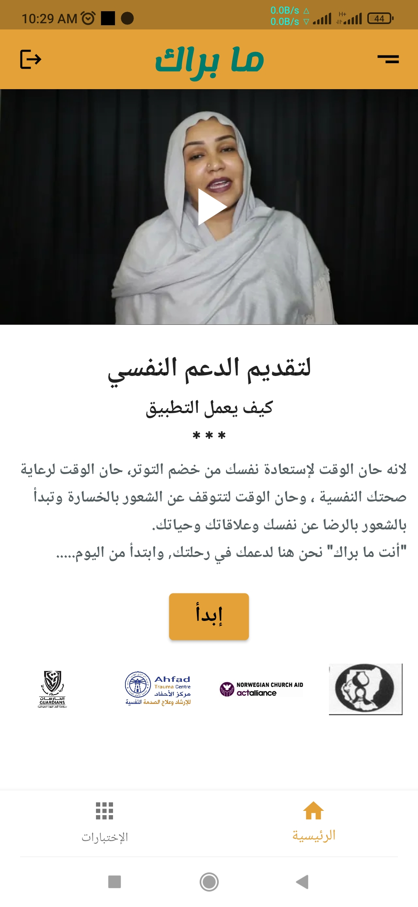
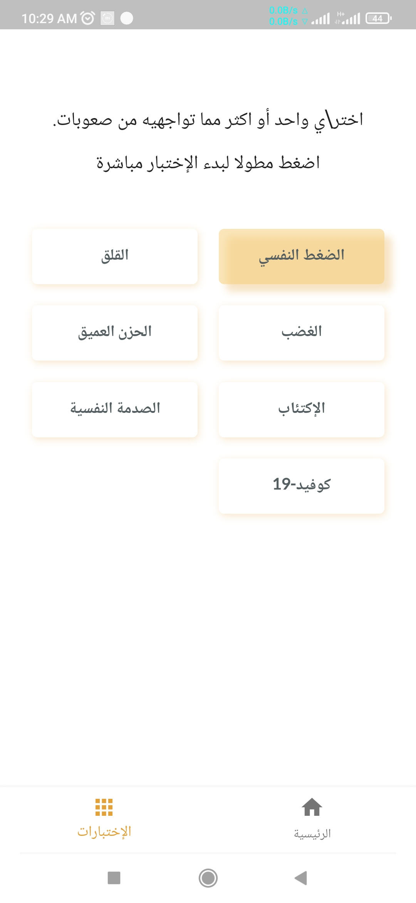
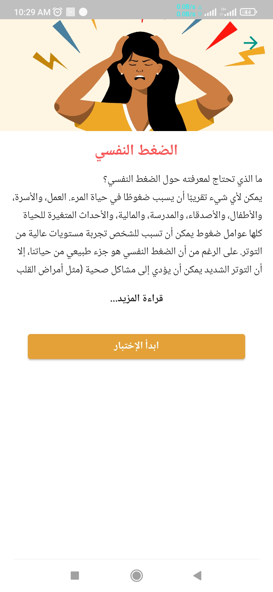
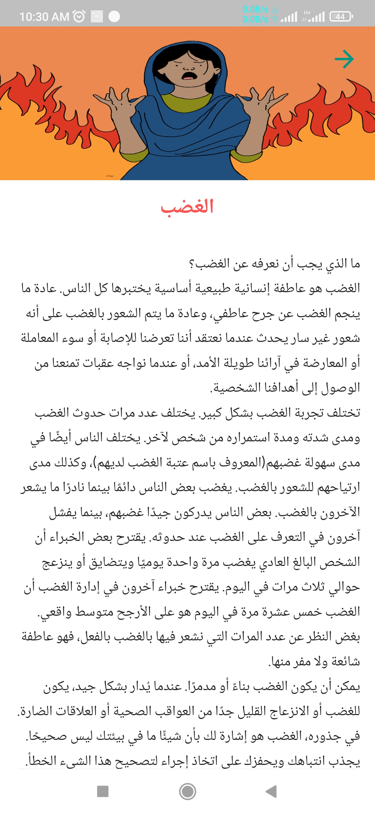
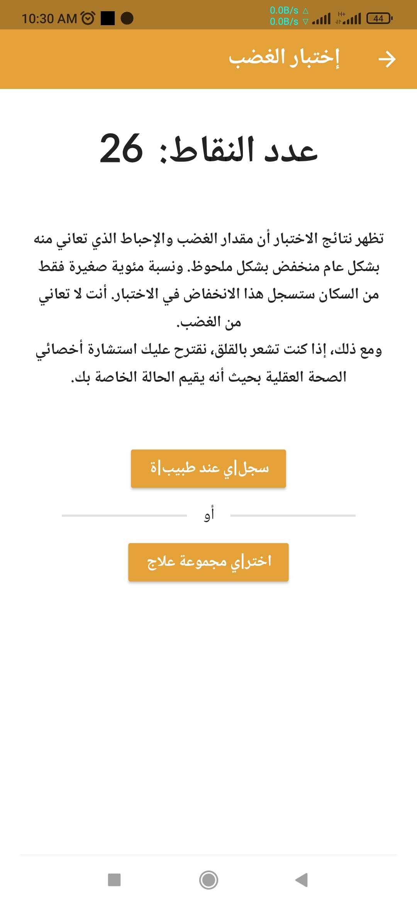
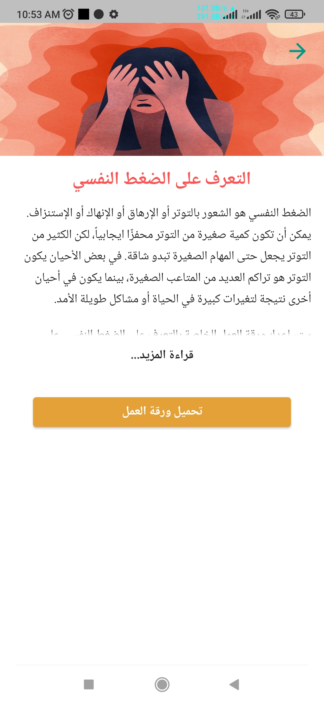

# Flutter app Samples

note: these apps aren't released yet but very soon they'll be.

## 1. Therapy

We are working with the ahfad university to produce therapy mobile app . The app provides tests to identify issues users struggling with, as well as online chatting with psychiatrists to guide them through the treatment, it also introduces worksheets and an activity scheduler.

   
   
   
   
   

## 2. Wasil 
 We are doing an application for the wasil company -known for delivery of fuel-, the app intended to simplify the adminstration process of recieving customers orders and contacting drivers for delivery. 

   
   
   

